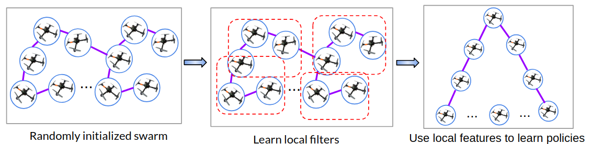

## Graph Policy Gradients for Large Scale Robot Control
#### In CoRL 2019, Oral Paper [[Paper]](https://arxiv.org/pdf/1907.03822.pdf)[[Video]](https://www.youtube.com/watch?v=RefiX9UCCw8)[[Blog Post]](https://devmesh.intel.com/projects/graph-policy-gradients-for-large-scale-robot-control)[[CoRL Talk]](https://youtu.be/b7StSnt85S4?t=8604)

[Arbaaz Khan](https://www.seas.upenn.edu/~arbaazk/), [Ekaterina Tolstaya](https://katetolstaya.github.io/), [Alejandro Ribeiro](https://alliance.seas.upenn.edu/~aribeiro/wiki/), [Vijay Kumar](https://www.kumarrobotics.org/dr-vijay-kumar/)<br/>
GRASP Lab, University of Pennsylvania <br/>

  

This repository contains the code for our paper  Graph Policy Gradients for Large Scale Robot Control. The idea is to train a large number of agents by exploiting local structure using Graph Convolutional Networks. Training code as well as inference code is included in this implementation. 


### Installation and Usage
  First install the formation flying environment from inside gym_formation/. Instructions provided in the enclosed readme file.
  
  Install deep graph library (https://www.dgl.ai/) and compatible version of PyTorch.

  # Running the code:
  ```Shell
  cd rl_code
  #To train GPG from scratch. (See additional point below)
  python3 main.py 
  #Inference for a larger swarm (loads model from ./logs)
  python3 parameter_reload.py 
```
- A simple arrowhead formation is specified in constr_formation_flying.py (inside gym_formation/gym_flock/envs/)
To increase the number of agents simply change the parameter self.n_agents in constr_formation_flying.py, line 39.

- Make sure to change the number of agents to a small number if training from scratch (Ideally < 10)  